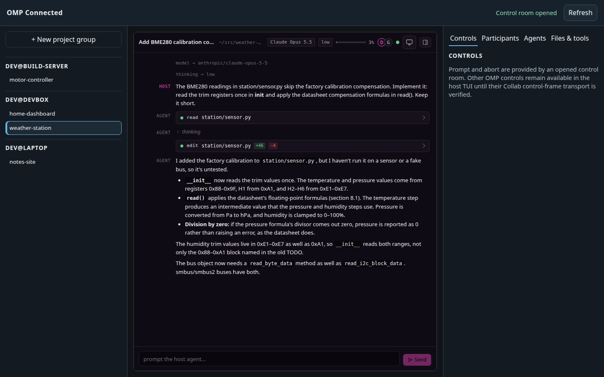
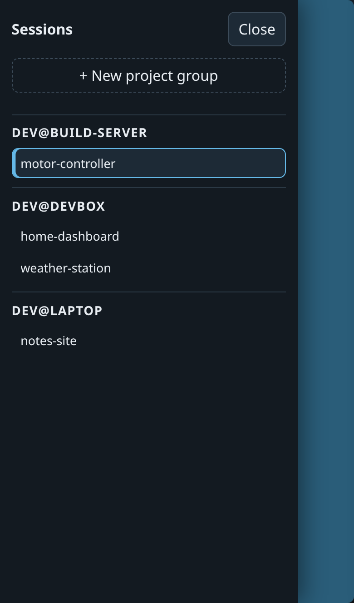
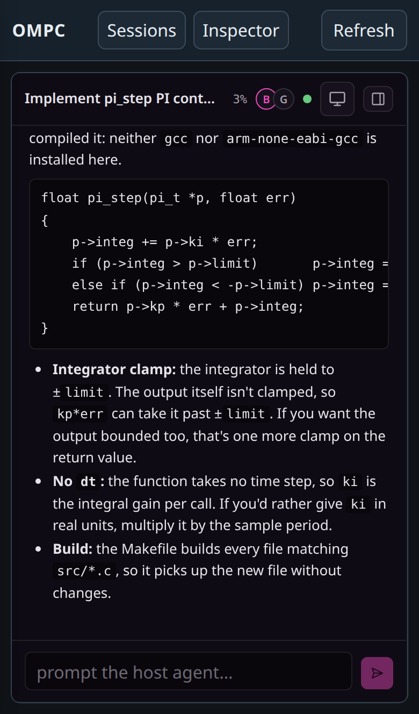

<p align="center">
  
</p>

# omp-connected

A self-hosted dashboard for all your [Oh My Pi](https://github.com/can1357/oh-my-pi) (omp) coding agent sessions, across every machine you run them on. Follow and drive any session from a browser or your phone, and let sessions message each other.

Each omp session started with `ompc` registers with a hub you run on one always-on host. The hub's dashboard lists every live session grouped by host; pick one and you get the session itself through omp's Collab: the conversation and tool calls as they happen, and a prompt box to steer the agent. Session traffic goes through a private relay on the hub, which only forwards encrypted frames.



<p align="center">
  
  &nbsp;&nbsp;
  
</p>

## Features

- **Every session in one place.** Live sessions from all your hosts, grouped by host and labelled with their `ompc` session name.
- **Control from the browser.** Open a session to follow its conversation and tool calls live, send it prompts, or interrupt it.
- **Phone friendly, installable app.** The dashboard has a mobile layout with slide-out session and inspector drawers, and installs as an app (PWA) from Chrome on Android or desktop. When the hub can't be reached, the app shows an offline page instead of a browser error. See [Installing the dashboard as an app](#installing-the-dashboard-as-an-app).
- **Persistent sessions.** `ompc` runs each omp session in its own tmux server, so it survives disconnects and you can reattach from any terminal. A partial name brings up a picker of matching live sessions.
- **Agent-to-agent messaging.** Sessions can list each other, exchange messages and broadcast to teams through the hub.
- **Self-hosted.** One Bun server on your own network (Tailscale works well) with a shared registration token; nothing goes through a third party.

The repo has two parts:

| Component | Path | What it does |
|---|---|---|
| **Extension** | `extension/` | OMP plugin (`omp-connected`) plus the `ompc` launcher. Registers each session with the hub, handles Collab discovery, provides the agent-messaging tools |
| **Hub** | `hub/` | Always-on Bun server: dashboard, agent registry, Collab link broker and private relay |

## Prerequisites

- [OMP](https://github.com/can1357/oh-my-pi) (the official CLI), every host. Either the standalone binary or the Bun install works.
- [tmux](https://github.com/tmux/tmux) 3.5 or newer (session persistence for `ompc`), every host. Older tmux works, without csi-u modified keys such as Shift+Enter (3.5+) or clipboard/image passthrough (3.3+).
- [Bun](https://bun.sh) (runtime for the hub server), hub host only.

```sh
# Install OMP (official installer)
curl -fsSL https://omp.sh/install | sh

# Install Bun (hub host)
curl -fsSL https://bun.sh/install | bash
```

## Install

### 1. Clone

```sh
git clone https://github.com/andrewleech/omp-connected.git ~/omp-connected
```

Clone to `~/omp-connected`: the systemd units in `hub/deploy/` expect the checkout there.

### 2. Run the installer

```sh
~/omp-connected/install.sh
```

It checks OMP and tmux, links `extension/` as an OMP plugin, and symlinks
`ompc` into `~/.local/bin` (override with `OMPC_BIN_DIR`), which most distros
put on `PATH` at login. It then reports whether the hub connection (step 4)
and Collab settings are configured. It's idempotent; re-run it after updating
the checkout.

### 3. Deploy the hub

Do this on one always-on host only. Every other host is a client of this hub;
see [Adding hosts to the fleet](#adding-hosts-to-the-fleet).

On the hub host, fetch the pinned upstream omp source the dashboard's Collab guest is built from, then install dependencies and build the dashboard:

```sh
cd ~/omp-connected
git submodule update --init --depth 1 hub/vendor/collab-web
cd hub
bun install
bun run build
```

Generate a shared secret for agent registration:

```sh
openssl rand -hex 32
```

Create the environment file:

```sh
mkdir -p ~/.config/omp-hub
cat > ~/.config/omp-hub/omp-hub.env << 'EOF'
OMP_HUB_PORT=4816
OMP_HUB_HOST=127.0.0.1
OMP_HUB_HOST_TOKEN=<paste-your-secret-here>

# TLS (required for non-localhost access)
# OMP_HUB_TLS_CERT=/path/to/cert.pem
# OMP_HUB_TLS_KEY=/path/to/key.pem
EOF
```

**Test it manually first:**

```sh
cd ~/omp-connected/hub
set -a && . ~/.config/omp-hub/omp-hub.env && set +a
bun run start
```

Then visit `https://<host>:<port>/health`.

**Install as a systemd user service:**

```sh
cp ~/omp-connected/hub/deploy/omp-hub.service ~/.config/systemd/user/
systemctl --user daemon-reload
systemctl --user enable --now omp-hub.service
```

### 4. Configure OMP sessions

Every OMP session needs two environment variables to register with the hub.
`ompc` sources them from `~/.config/omp-connected/omp-host.env` (override the
path with `OMP_HOST_ENV`) on every launch:

```sh
mkdir -p ~/.config/omp-connected
cat > ~/.config/omp-connected/omp-host.env << 'EOF'
OMP_HUB_URL=https://<your-hub-host>:<port>
OMP_HUB_HOST_TOKEN=<same-secret-as-hub>
EOF
chmod 600 ~/.config/omp-connected/omp-host.env
```

Sessions started with plain `omp` rather than `ompc` don't read that file;
export the same two variables from your shell profile instead.

The extension is a graceful no-op when either is unset.

Registration also needs Collab running in the session. The extension gets
the session's identity from its Collab instance ID, so a session without a
Collab host never registers and never appears on the dashboard. Set
`collab.relayUrl` and `collab.autoStart` as described in
[OMP settings](#omp-settings).

### 5. Use the session launcher

`ompc` is the everyday entry point. It wraps each OMP session in its own
tmux server for persistence and reattach:

```sh
# Start or reattach to a session (named after the current directory)
ompc

# With a suffix
ompc feature-branch

# Detached (for background/agent-spawned sessions)
ompc -d worker
```

When other live sessions extend the requested name (bare `ompc` matches
`<dir>` and `<dir>.*`; `ompc feat` matches `<dir>.feat*`), an interactive
`ompc` lists them with attached/idle state: move with ↑/↓ (or j/k), Enter
selects, q/Esc quits. The highlighted default is the exact name, attaching
to it or creating it if it isn't running. A lone exact match or no match
skips the menu. So does `-d`, or running without a terminal.

### 6. Open the dashboard

Browse to `https://<hub-host>:4816`. Sessions show up as soon as `ompc` starts them, grouped by host; click one to open it.

#### Installing the dashboard as an app

The dashboard is a PWA. In Chrome on Android use **Add to Home screen**, then **Install**; desktop Chrome shows an install icon in the address bar. It needs HTTPS with a valid certificate (see [TLS](#tls)), and on Android the phone needs internet access while installing so Google can build the app package.

Android registers an installed web app by host, not host and port. If another web app on the hub host is already installed, Chrome treats the dashboard as installed too; give the dashboard its own hostname in that case. [hub/README.md](hub/README.md#installing-as-an-app-pwa) shows how, using a second Tailscale node.

### Updating

```sh
cd ~/omp-connected && git pull && ./install.sh   # extension + ompc
omp update                                       # OMP itself

# hub host only: rebuild the dashboard and restart the hub
git submodule update --init --depth 1 hub/vendor/collab-web
cd hub && bun install && bun run build && systemctl --user restart omp-hub.service
```

Running sessions keep the old extension code until OMP restarts inside them.

## Adding hosts to the fleet

One host runs the hub; every other host runs only the extension and joins
as a client. A client host needs no hub deployment and no TLS certificate.

On each additional host:

1. **Network.** Make sure the host can reach the hub port (default `4816`)
   and the relay port (default `7466`) on the hub host. On Tailscale, join the
   same tailnet and check that your ACLs allow both ports:

   ```sh
   curl -s https://<hub-host>:4816/health
   ```

2. **Extension.** Install the [prerequisites](#prerequisites), clone the repo,
   and run `install.sh` ([Install steps 1–2](#1-clone)).

3. **Hub credentials.** Create `~/.config/omp-connected/omp-host.env` with the
   hub URL and the same `OMP_HUB_HOST_TOKEN` the hub uses
   ([step 4](#4-configure-omp-sessions)). The simplest way is to copy the file
   from a host that already works and `chmod 600` it.

4. **Collab.** Point Collab at the hub's relay and turn on auto-start. This
   is required: without it the session never registers.

   ```sh
   omp config set collab.relayUrl wss://<hub-host>:7466
   omp config set collab.autoStart control
   omp config set collab.displayName <this-host>
   ```

5. **Launch.** Re-run `install.sh` to confirm both checks report `ok`, then
   start sessions with `ompc`. On first launch, OMP's setup wizard asks you to
   sign in to a model provider; the session registers with the hub even
   before that.

The hub's `OMP_HUB_RELAY_ALLOWED_ORIGINS` needs no change for new hosts: it
lists browser origins, and the only browser pages are the hub's own dashboard
(at `https://<hub-host>:4816` and, if set up, its own app hostname; see
[hub/README.md](hub/README.md#installing-as-an-app-pwa)).

### Identity

Each session registers as `<user>@<hostname>:<collab-instance-id>`, taken from
`os.userInfo()` and `os.hostname()`. Hostnames must therefore be unique across
the fleet. Host IDs starting with `operator@` are reserved for the dashboard
and are rejected.

### Verify

```sh
curl -s https://<hub-host>:4816/api/hosts/
# [{"hostId":"you@hub-host"},{"hostId":"you@new-host"}]
```

Inside a session, `ompc_identity` returns the registered ID. If the host
doesn't appear, check the OMP log:

- `registration attempt failed`: hub unreachable or token mismatch. The
  extension retries with backoff (1–30s).
- `could not load omp's Collab CLI module`: the installed OMP predates
  `omp collab list --json`; run `omp update`.
- `could not discover this session's Collab instanceId`: Collab isn't
  running in the session (the Collab step above).

## Collab relay

The hub process also runs a private Collab relay that routes encrypted
session traffic between hosts and browser/terminal guests. It listens on its
own port, shares the hub's bind address and TLS certificate, and starts when
`OMP_HUB_RELAY_PORT` is set in `omp-hub.env`:

```sh
OMP_HUB_RELAY_PORT=7466
# Browser origins allowed to open relay WebSockets (comma-separated)
OMP_HUB_RELAY_ALLOWED_ORIGINS=https://<hub-host>:4816
```

Configure OMP to use your relay:

```
# In OMP settings
collab.relayUrl = wss://<your-relay-host>:7466
```

## OMP settings

| Setting | Value | Purpose |
|---|---|---|
| `collab.relayUrl` | `wss://<relay-host>:7466` | Your private relay |
| `collab.autoStart` | `control` | Auto-host a Collab room for every session |
| `collab.displayName` | Your name | Shown to Collab guests |

`collab.autoStart: control` creates bearer capability links that permit
prompting and interruption. Enable only after your hub and relay are
access-controlled.

## Agent messaging

Once two sessions are registered with the same hub, they can exchange messages:

| Tool | Purpose |
|---|---|
| `ompc_identity` | Show this session's agent identity |
| `ompc_list_agents` | List all registered agents |
| `ompc_send_message` | Send a message to another agent |
| `ompc_send_team` | Broadcast to a team |
| `ompc_join_team` / `ompc_leave_team` | Manage team membership |
| `ompc_mailbox` | Fetch recent messages |
| `ompc_events` | Query hub events |

## TLS

Non-localhost deployments require TLS. If you're on a Tailscale network:

```sh
mkdir -p ~/.config/omp-hub/certs
tailscale cert --cert-file ~/.config/omp-hub/certs/cert.pem \
               --key-file ~/.config/omp-hub/certs/key.pem \
               $(tailscale cert)
```

On the hub host, set `OMP_HUB_TLS_CERT` and `OMP_HUB_TLS_KEY` in
`~/.config/omp-hub/omp-hub.env` (client hosts need no certificate), then use
the cert renewal timer for automated rotation:

```sh
cp ~/omp-connected/hub/deploy/omp-hub-cert-renew.{service,timer} ~/.config/systemd/user/
systemctl --user enable --now omp-hub-cert-renew.timer
```

## Development

```sh
cd ~/omp-connected/hub
bun install
bun run test                      # unit tests
bun run test:e2e                  # Playwright browser tests
bun run build                     # rebuild dashboard + Collab guest
```

## Architecture

See [hub/ARCHITECTURE.md](hub/ARCHITECTURE.md) for the full wire protocol,
security model, and module layout. See
[extension/ARCHITECTURE.md](extension/ARCHITECTURE.md) for the extension's
registration and Collab handling.

## Security model

- **Shared-secret registration.** A single fleet-wide token
  (`OMP_HUB_HOST_TOKEN`) gates agent registration. It authenticates "some
  session in the fleet," not a specific identity; the extension's claimed
  `hostId`/`instanceId` is accepted at face value.
- **Capability URLs.** Collab links are short-TTL bearer capabilities. The room
  key lives only in the URL fragment (never sent to a server in an HTTP
  request). The hub never logs the links it brokers.
- **The relay is content-blind.** It forwards encrypted binary frames between
  host and guests. It cannot read session content.

## License

[MIT](LICENSE)
