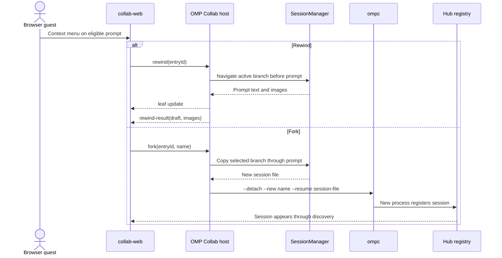

# Architecture

## Module layout

```
src/
  server/   Elysia HTTP + WebSocket server: REST routes, /ws/agent native
            agent-message registry (also the only channel host-level
            Collab discovery has), serves webui/ at "/" and webui/collab
            at "/collab/".
  relay/    src/relay/relay.ts — the Collab terminal-byte relay, started by
            the server on its own port (OMP_HUB_RELAY_PORT, e.g. 7466).
webui/
  (dashboard)   fleet dashboard served at "/".
  collab/       vendored Collab guest client, served at "/collab/".
```

The relay shares the hub process but no state: `src/server/index.ts`
starts it as a separate `Bun.serve()` listener and stops it on shutdown,
and nothing else crosses the boundary. The server only ever hands out
relay connection URLs (`wss://hub-host.your-tailnet.ts.net:7466/...`) inside
`CollabLinkResult.url`, which the browser guest then connects to.

## Agent protocol: `/ws/agent`

One WebSocket connection per `omp-connected` extension instance,
JSON-RPC 2.0 framed. The extension always speaks first with
`agent.register`; after that the server dispatches `agent.*` calls from
the extension (the agent, not the server, drives most calls), and the
server may itself push server-initiated requests over that same connection: `agent.message` when another agent sends to this one, `collab.list`/`collab.link` for host-level Collab discovery through a live connection for the hostId (there is no separate host-registration connection), `host.sessions.*` for history and launching through a capable connection, and `session.*`/`files.*` calls addressed to one specific agent for the dashboard's Session and Files tabs.
All push kinds are JSON-RPC *requests*; the extension's `{result: ...}`/`{error: ...}`
reply, matched on the request's own id, is both the delivery
confirmation and (for collab, host session, session and file calls) the RPC result itself.

```ts
interface JsonRpcRequest<M extends string = string, P = unknown> { jsonrpc: "2.0"; id: string; method: M; params: P; }
interface JsonRpcResult<R = unknown> { jsonrpc: "2.0"; id: string; result: R; }
interface JsonRpcError { jsonrpc: "2.0"; id: string; error: { code: number; message: string }; }

// Extension -> Server, once per connection, must be the first message
// label: optional display label (ompc's tmux session name), /^[A-Za-z0-9][A-Za-z0-9_.-]{0,63}$/
// features: optional capabilities the extension serves, at most 16 of /^[a-z][a-z0-9._-]{0,31}$/; absent means []
interface AgentRegisterParams { hostId: string; instanceId: string; pid: number; cwd: string; label?: string; features?: string[]; token: string; }
interface AgentRegisterResult { ok: true; agent: AgentSummary }

// Extension -> Server
interface AgentSendParams { to: string; content: string; replyTo?: string; idempotencyKey: string; }
interface AgentSendResult { ok: true; messageId: string; to: string; recipientOnline: boolean }
interface AgentSendTeamParams { team: string; content: string; replyTo?: string; idempotencyKey: string; }
interface AgentJoinTeamParams { team: string; }
interface AgentLeaveTeamParams { team: string; }
// agent.list_agents, agent.list_teams take no params
interface AgentGetMailboxParams { agent?: string; } // defaults to caller
interface AgentQueryEventsParams { event?: string; since?: number; limit?: number; agent?: string; }
// Sent when a turn starts or ends (and once after registering). The hub keeps the
// last value as AgentSummary.busy (absent until reported, so older extensions have none)
// and pushes {event: "agent.activity", agentId, busy} to /ws/dashboard on a change.
interface AgentActivityParams { busy: boolean; }

// Server -> Extension (server-initiated push; the extension's {result: ...}
// reply is its delivery receipt, matched on the message's own id)
interface AgentMessagePush { messageId: string; from: string; to: string; content: string; replyTo?: string; }

interface AgentSummary {
  id: string; // canonical: `${hostId}:${instanceId}`
  hostId: string; instanceId: string; label: string; // registered label, else basename(cwd); not unique
  features: string[]; // advertised at registration
  busy?: boolean; // mid-turn, once the extension has reported it
  status: "online" | "offline";
}

// Server -> Extension (server-initiated call, forwarded to whichever
// agent connection is currently live for the target hostId; the
// extension answers in-process from omp's `omp collab list|link --json`
// implementation (@oh-my-pi/pi-coding-agent/cli/collab-cli) — no subprocess)
interface CollabListParams {}
interface CollabListResult { sessions: HostCollabSession[] }
interface CollabLinkParams { instanceId: string; generation: number; access: "view" | "control"; }
interface CollabLinkResult { access: "view" | "control"; url: string; expiresAt: number }

interface HostCollabSession {
  instanceId: string; generation: number; access: "view" | "control"; pid: number;
  sessionId: string; sessionName: string | null; cwd: string;
  model: { provider: string; id: string } | null; startedAt: number;
  participants: number; relayConnected: boolean; inputRequired: boolean;
  label?: string; // hub-added from the registered agent, absent if none
  features: string[]; // hub-added from the registered agent, [] if none
}
```

### Session inspection and file transfer (`session.v1`)

An extension that registers with `features: ["session.v1"]` answers the inspector calls for its own omp session. The optional `session.schedule.v1` and `session.exit.v1` features advertise scheduled prompts and graceful session exit respectively. The hub sends each call to that agent's own connection (`AgentRegistry.callOnAgent`), never to another agent on the same host.

```ts
"session.info" {} -> { cwd; pid; sessionName; access: "view" | "control"; idle; model; thinkingLevel; thinkingLevels: string[]; contextUsage; models }
"session.abort" {} -> { ok: true }
"session.exit" {} -> { ok: true }  // shuts down OMP after its reply is sent; an ompc tmux server exits with its only pane
"session.compact" { instructions?: string } -> { ok: true }  // starts compaction; busy while the session is working
"session.set_model" { provider: string; id: string } -> { ok: true }
"session.set_thinking" { level: string } -> { ok: true }
"files.list" { path } -> { path; entries: { name; type: "file" | "dir" | "symlink" | "other"; size; mtimeMs; target?: "file" | "dir" }[] }
"files.stat" { path } -> { path; type; size; mtimeMs }  // a symlink reports its resolved target's size and mtime
"files.read" { path; offset; length <= 262144; expect?: { size; mtimeMs } } -> { data: base64; size; mtimeMs; eof }
"files.write" { path; uploadId; offset; data: base64; final; overwrite } -> { ok: true; path; size }
"files.write_abort" { path; uploadId } -> { ok: true }
"files.mkdir" { path } -> { ok: true }
```

Paths are POSIX, relative to the session's working directory at start (realpath'd); the extension refuses absolute paths, NUL bytes, `..` above the root and anything whose realpath (including through a symlink) is outside the root. `session.info` is always answered; every other method needs the session's own Collab share to have `control` access. `session.exit` calls OMP's graceful shutdown after the RPC reply has been sent, so the dashboard receives an answer before the session disconnects. Uploads go to a temp file `.<name>.omp-upload-<uploadId>` next to the target and are renamed into place on the final chunk; unfinished uploads are discarded after 10 minutes without a chunk and when the session shuts down.

Error codes and their REST mapping: -32001 not found (404), -32002 exists (409), -32003 forbidden (403), -32004 invalid (400), -32005 changed during a download (409), -32006 busy (409), -32601 unknown method (501, an extension without `session.v1`), anything else 502. A call with no reply in 15 s answers 504.

### Scheduled prompts (`session.schedule.v1`)

An extension that also advertises `session.schedule.v1` holds prompts queued from the dashboard and sends them to its own session when they fall due, through the same path as any other prompt (queued as a follow-up while the session is busy). They live in the omp process's memory: they survive the dashboard closing and the hub restarting, and are dropped (with a notice in the TUI) when the session switches to another conversation or shuts down. The TUI's status line shows how many are waiting and when the next is due.

```ts
"session.schedule_prompt" { text: string; delayMs: number } -> { id; text; fireAt; createdAt }  // fireAt by the session host's clock
"session.scheduled" {} -> { prompts: { id; text; fireAt; createdAt }[] }  // soonest first
"session.cancel_scheduled" { id } -> { ok: true }  // -32001 once it has been sent
```

`delayMs` is a whole number of milliseconds up to 7 days, `text` at most 100,000 characters, and at most 20 prompts wait per session. All three need `control` access, like the other methods. The session re-reads the wall clock at least once a minute, so a host that sleeps through a due time sends the prompt when it wakes.

### Host session history and launching (`host.sessions.v1`)

A capable connected extension answers host-wide history and launch requests. The hub chooses the longest-connected agent advertising `host.sessions.v1`, rather than an older extension on the same host. The extension requires a local control share, reads OMP's own history, excludes open conversation UUIDs (including ownership leases without a Collab share), and resolves a selected UUID to its local journal before launching. A host with no connected extension cannot be started remotely.

```ts
"host.sessions.list" {} -> { sessions: { sessionId; cwd; title; modifiedAt; name?: string }[] }
"host.sessions.start" { cwd; name; sessionId?: string } -> { ok: true; label }
```

`modifiedAt` is epoch milliseconds, history is newest-first, and `name` is the remembered `ompc` suffix, not the conversation title. Path accepts an absolute directory or `~/...`; a blank name starts the directory's bare `ompc` name. The combined directory basename and suffix must meet the launcher's 64-character name rule. Launching uses detached `ompc --new`, so a live name collision returns 409 rather than attaching. Selecting a conversation already open or starting also returns 409. A new conversation bypasses OMP's configured auto-resume. Successful launch means tmux accepted the process, its extension then registers through the normal flow.

REST: `GET /api/hosts/:id/session-history` and `POST /api/hosts/:id/sessions` expose those results and parameters. Requests share a host limit of 20 per 10 seconds, with a 30-second RPC deadline. A disconnected host answers 404, no capable extension answers 501, and remote errors use the session RPC HTTP mapping.

**No independent identity check.** `agent.register` is token-gated
only: `hostId`, `instanceId`, `cwd`, and `label` are the extension's own
claim, used directly (`label`, else `cwd`, for the agent's display label). There is no second,
independent connection to confirm them against — unlike the Collab
relay's own trust model, this registry does not require a claimed
session to be independently observable elsewhere before admitting it.
Accepting the shared token is accepting the identity claim that comes
with it.

REST routes built on top of the same live registry:

- `GET /api/hosts` → `{ hostId: string }[]` — hostIds with at least one
  currently-connected agent. A host with zero connected agents has
  nothing that can answer collab.list/collab.link and does not appear
  here.
- `GET /api/hosts/:id/collab` → `{ sessions: HostCollabSession[] }` —
  forwards a `collab.list` call to any one agent connection currently
  live for that hostId, and adds each session's registered agent `label`.
- `POST /api/hosts/:id/collab/:instanceId/link` `{ generation, access }` →
  `{ access, url, expiresAt }` — forwards a `collab.link` call the same
  way.
- `/api/hosts/:id/sessions/:instanceId/...`: the `session.v1` calls for the agent `${id}:${instanceId}`: 404 when it isn't connected, 501 when it didn't advertise the required feature (`session.schedule.v1` for scheduling, `session.exit.v1` for exit, otherwise `session.v1`).
  - `GET info`, `POST abort`, `POST exit`, `POST compact` `{ instructions? }`, `POST model` `{ provider, id }`, `POST thinking` `{ level }`.
  - `GET scheduled`, `POST scheduled` `{ text, delayMs }`, `DELETE scheduled/:scheduleId`.
  - `GET files?path=` lists a directory, `POST files/mkdir` `{ path }` creates one.
  - `GET files/download?path=[&inline=1]` streams a file as `files.read` chunks of 256 KiB, each checked against the size and mtime of the initial `files.stat`, so a file that changes mid-download errors the stream instead of mixing versions. The response is always `attachment` with `content-security-policy: sandbox` and `nosniff`; `inline=1` only applies to PNG, JPEG, GIF and WebP.
  - `PUT files/upload?path=&overwrite=0|1` streams the raw body into `files.write` chunks of 256 KiB, awaiting each before reading on; over 256 MiB answers 413 and aborts the upload.
  - Control actions (abort, exit, compact, model, thinking, mkdir, and queueing or cancelling a scheduled prompt) share a limit of 20 per 10 s per session, and each session has at most 4 transfers in flight; both answer 429.
- `GET /api/agents` → `{ agents: AgentSummary[] }`.
- `POST /api/agents/:id/send` `{ content, replyTo?, idempotencyKey }` →
  sends as `operator@<hub-host>` (dashboard-only; the dashboard is never
  a registered agent connection, so it can only send as this reserved
  principal, never spoof a real agent's identity); `:id` accepts a
  canonical ID or an unambiguous display label.
- `GET /` — the fleet dashboard webui.
- `GET /manifest.webmanifest`, `GET /sw.js` — PWA manifest and service
  worker, served `cache-control: no-cache` (outside the static plugin's
  day-long max-age) so installed clients pick up changes. `sw.js` only
  intercepts top-level navigations, falling back to a cached
  `/offline.html` when the hub is unreachable.
- `/collab/` — the vendored Collab guest client.

## Collab rewind and fork

On the forked Collab guest and OMP host, a writable browser guest can act on an eligible prompt in the transcript. Eligibility is limited to user-authored prompt entries on the active branch.

The browser offers actions only when the guest has write access, the host is idle, and no UI request or command suggestions are open; the host independently checks write access, session state and the active branch. The guest's context menu is opened by right-click or long-press. Rewind requests travel through the Collab host protocol, and the host applies the same branch navigation used by the local rewind selector. On success the host moves its active branch to before the selected prompt and returns that prompt's text and images to the requesting guest's composer. The host's leaf updates are sent to guests so their transcript follows the active branch.

Fork creates a separate named session, not another branch in the existing conversation. The host copies the selected branch through the selected prompt into a distinct session file, then launches `ompc --detach --new <name> --resume <session-file>`. The new process owns that file; the original process and session file remain unchanged. Once the new session's extension registers it, the hub's normal registration and Collab discovery flow makes it selectable in the dashboard.



The host and hub are deployment roles, not fixed machines; examples in
deployment documentation use placeholder hostnames such as
`hub.example.test` and `host-a.example.test`.

## Security model

- **Shared-secret agent registration, self-attested identity.**
  `AgentRegisterParams.token` must match `OMP_HUB_HOST_TOKEN`, configured
  identically on the server and in every interactive OMP session's
  environment. If it doesn't match, registration is rejected and the
  socket is closed immediately. A session reachable on the tailnet is
  not implicitly trusted; only the shared token admits it — but the
  token is a single fleet-wide secret, not scoped per host or session,
  so it authenticates "some session in the fleet," not "this specific
  hostId/instanceId." Anything holding the token can register under any
  claimed identity.
- **Capability URLs stay client-side only.** The `url` returned by
  `collab.link` (a short-TTL, capability-bearing relay URL) is handed to the
  browser and lives only in the URL fragment (`#...`), which is never sent
  to any server in an HTTP request line and is excluded from all
  server-side request/access logging. The server itself never logs the
  URLs it mints.
- **Short-TTL links.** Every `CollabLinkResult.expiresAt` is a near-term
  timestamp; expired links are rejected by the relay on connect. A fresh
  link must be requested (and freshly authorized by the host) for each new
  guest session — links are not long-lived bearer tokens.
- **Session controls and files follow the Collab share.** The dashboard's `session.v1` routes have no authentication of their own beyond reaching the hub, like the rest of the REST API. What they can do is decided by the omp session: only `session.info` works on a view-only share, and file access is confined to the session's working directory by realpath. Downloads are always served with `content-security-policy: sandbox` and `x-content-type-options: nosniff`, and only raster images may be shown inline, so a file from a session cannot run script in the dashboard's origin.

## Scope

- This server does not launch, mirror, or otherwise manage OMP sessions
  itself. The local `omp` CLI (via the `omp-connected` extension loaded
  inside it) owns that; this server only ever talks to a *registered*
  agent's existing session through `/ws/agent`.
- Its own registry (agents, Collab sessions, brokered links) is fully
  independent and does not merge with, read, or depend on any other
  service's state.